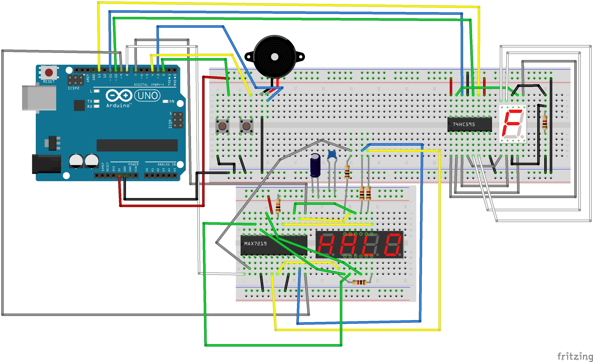

# Row Select

Row Select is a game that challenges players to select four digits in a row. The digits change randomly, and the player must choose the same number as the previous one in the sequence. Upon successfully selecting four identical digits, the player advances to the next level. The speed of digit changes increases with each level. There are nine levels in total, and upon reaching the final level, a winning song will play. If the player selects the wrong number, the game stops, and they can restart the level using the second button.

## Circuit

## Used components
- Arduino UNO;
- Breadboard;
- Seven Segment Display 1 Digit With Common Cathode `5161AS`;
- Seven Segment Display 4 Digit With Common Cathode `SM4200364L`;
- Push button (2x);
- Passive Buzzer;
- Shift Register Parallel In Serial Out `74HC595`;
- Display Driver `MAX7219`;
- Resistor `1kOm` (5x);
- Resistor `10kOm`;
- Ceramic capacitors `104`
- Electrolytic capacitor `100 uF`;

## Used Libs
- [ButtonDebounce](https://www.arduino.cc/reference/en/libraries/buttondebounce/)
- [LedControl](https://www.arduino.cc/reference/en/libraries/ledcontrol/)